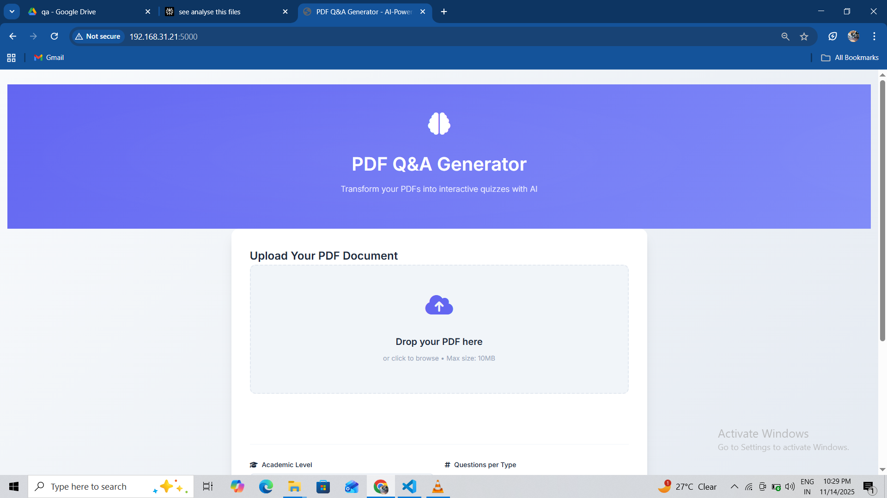
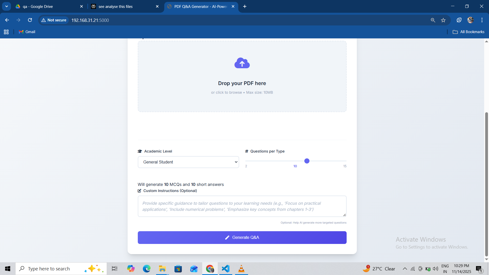
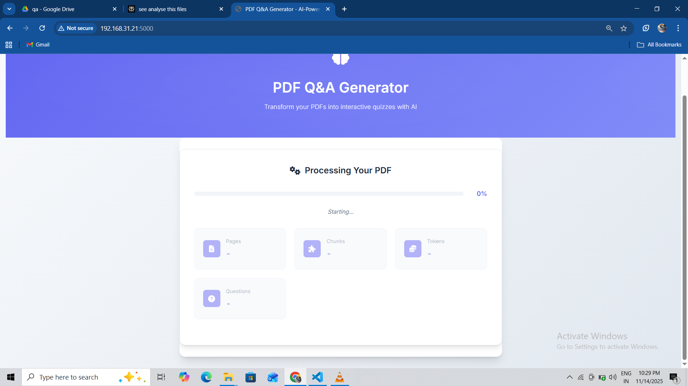
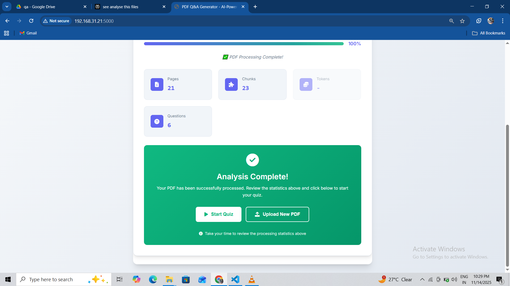
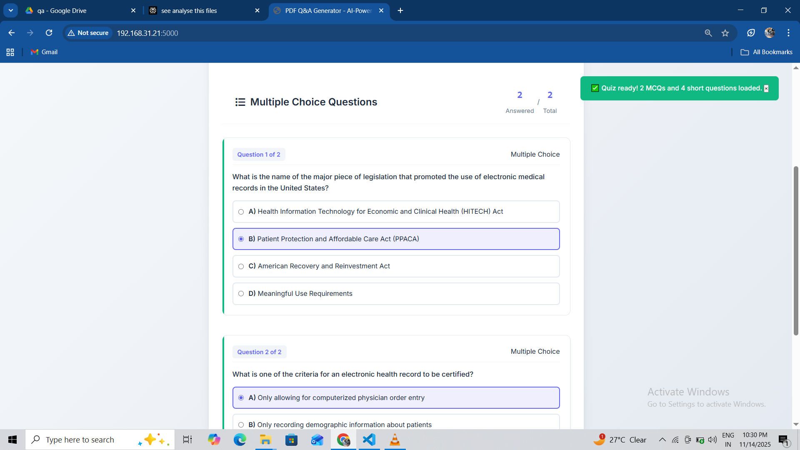
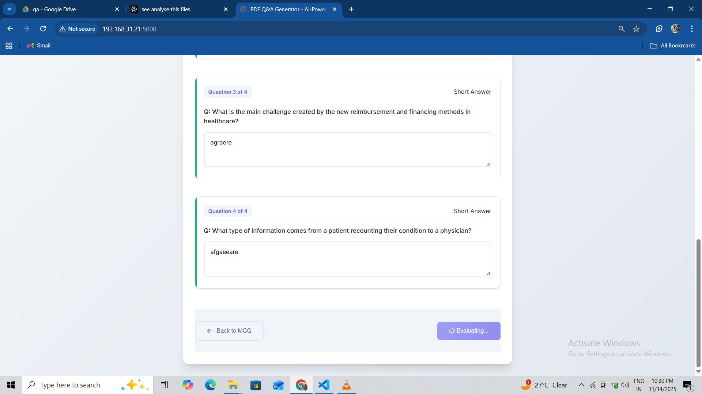
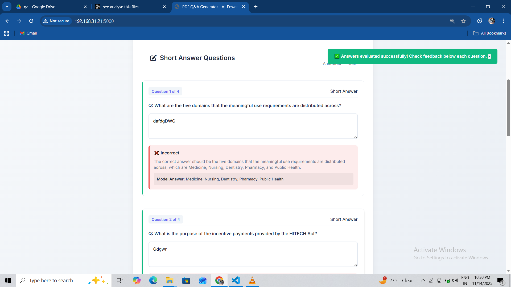
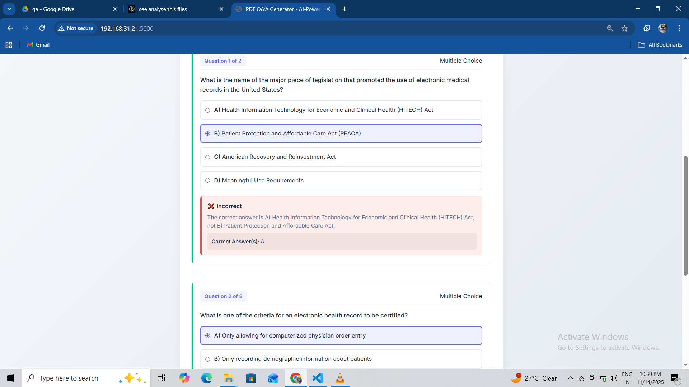
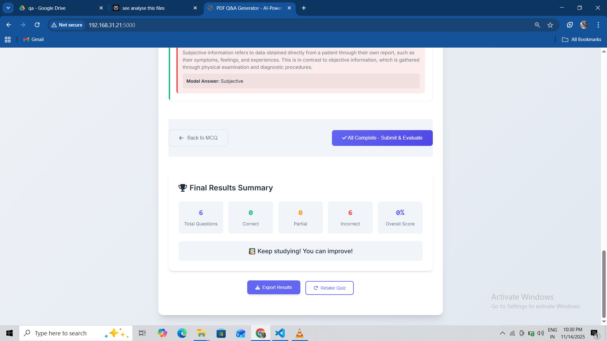

# 🧠 PDF Q&A Generator

### Transform PDFs into Interactive AI-Powered Quizzes

[Features](#-features) • [Demo](#-demo) • [Installation](#-installation) • [Usage](#-usage) • [Tech Stack](#-tech-stack) • [Contributing](#-contributing)

---

## 📋 Overview

**PDF Q&A Generator** is an intelligent web application that converts educational PDF documents into interactive quizzes using advanced AI language models. It automatically detects relevant content, generates profession-specific questions, and provides instant evaluation with detailed feedback.

Perfect for **students**, **educators**, and **e-learning platforms** looking to create engaging assessments from textbooks, lecture notes, research papers, and educational materials.

---

## ✨ Features

### 🎯 Core Capabilities
- **Smart PDF Processing** - Automatically detects content start, skips front matter (TOC, copyright pages)
- **AI-Powered Question Generation** - Creates MCQs and short-answer questions using Groq's Llama 3.1
- **Profession-Specific Content** - Tailored for High School, Engineering, Medical, Law, and Professional levels
- **Real-Time Progress Tracking** - Live updates with detailed statistics during processing
- **Automated Answer Evaluation** - Instant AI grading with explanations
- **Quality Filtering** - Removes irrelevant meta-questions about document structure

### 🎨 User Experience
- **Modern UI** - Clean, responsive design with gradient theme
- **Drag & Drop Upload** - Intuitive file handling (max 10MB)
- **Interactive Dashboard** - Real-time stats: pages, chunks, tokens, questions
- **Mobile Responsive** - Works seamlessly on all devices

---

## 🎬 Demo

  
### Landing Page

### Upload & Configuration

### Real-Time Processing

### Quiz Interface MCQ

### Answer Evaluation

### Result summary

---

## 🛠️ Tech Stack

### Backend
- **Python 3.8+** - Core language
- **Flask** - Web framework
- **LangGraph** - Workflow orchestration
- **LangChain** - LLM framework
- **Groq API** - Fast LLM inference (Llama 3.1)
- **ChromaDB** - Vector database for semantic search
- **PyPDF2** - PDF text extraction

### Frontend
- **HTML5 / CSS3** - Structure and styling
- **Vanilla JavaScript** - No frameworks, fast and lightweight
- **Modern UI/UX** - Gradient design, animations, progress bars

### Infrastructure
- **python-dotenv** - Environment variable management
- **Docker Ready** - Containerization support
- **Deploy Anywhere** - Heroku, Railway, AWS, Render compatible

---

## 🚀 Installation

### Prerequisites
- Python 3.8 or higher
- Groq API Key ([Get one free](https://console.groq.com/))
- Git

### Step 1: Clone Repository
git clone https://github.com/yourusername/pdf-qa-generator.git
cd pdf-qa-generator

text

### Step 2: Create Virtual Environment
Windows
python -m venv venv
venv\Scripts\activate

macOS/Linux
python3 -m venv venv
source venv/bin/activate

text

### Step 3: Install Dependencies
pip install -r requirements.txt

text

### Step 4: Configure Environment Variables
Copy example file
cp .env.example .env

Edit .env and add your API key
GROQ_API_KEY=your_api_key_here
text

### Step 5: Run Application
python app.py

text

Open your browser and navigate to: [**http://localhost:5000**](http://localhost:5000)

---

## 📖 Usage

### Quick Start

1. **Upload PDF Document**
   - Drag & drop or click to browse
   - Supported: Educational PDFs up to 10MB

2. **Select Academic Level**
   - General Student
   - High School (11th Grade)
   - Engineering
   - Medical
   - Law
   - Professional

3. **Set Question Count**
   - Use slider: 2-15 questions per type
   - Total questions: MCQs + Short Answers

4. **Generate Questions**
   - Click "Generate Q&A"
   - Watch real-time progress
   - View processing statistics

5. **Take Quiz**
   - Answer MCQs (Multiple Choice)
   - Complete Short Answer questions
   - Submit for AI evaluation

6. **Review Results**
   - Get instant feedback
   - View correct answers
   - See detailed explanations

---

## 📁 Project Structure

pdf-qa-generator/
│
├── app.py # Main Flask application
├── requirements.txt # Python dependencies
├── .env.example # Environment variables template
├── .gitignore # Git ignore rules
├── README.md # This file
├── LICENSE # MIT License
│
├── static/
│ ├── script.js # Frontend JavaScript
│ └── style.css # Styling
│
├── templates/
│ └── index.html # Main HTML template
│
├── screenshots/ # Demo images
│ ├── landing.png
│ ├── upload.png
│ ├── progress.png
│ ├── quiz.png
│ └── results.png
│
└── docs/ # Additional documentation
├── ARCHITECTURE.md # System architecture
├── DEPLOYMENT.md # Deployment guides
└── CONTRIBUTING.md # Contribution guidelines

text

---

## 🔧 Configuration

### Environment Variables

| Variable | Description | Required |
|----------|-------------|----------|
| `GROQ_API_KEY` | Your Groq API key for LLM access | ✅ Yes |
| `FLASK_ENV` | Environment (development/production) | ❌ No |
| `FLASK_DEBUG` | Enable debug mode | ❌ No |

### Customization

**Question Prompts** - Edit profession-specific prompts in `app.py`:
role_map = {
"11th": "High school teacher",
"engineering": "Engineering professor",
# Add your own...
}

text

**Chunking Parameters** - Adjust in `app.py`:
chunk_size = 400 # Words per chunk

text

**UI Theme** - Modify colors in `static/style.css`:
:root {
--primary-color: #667eea;
--secondary-color: #764ba2;
}

text

---

## 🧪 Testing

### Manual Testing Checklist
- [ ] Upload various PDF types (textbooks, papers, notes)
- [ ] Test different academic levels
- [ ] Verify progress tracking accuracy
- [ ] Check question quality and relevance
- [ ] Test answer evaluation correctness
- [ ] Verify error handling
- [ ] Test on different browsers
- [ ] Check mobile responsiveness

### Future Automated Tests
- Unit tests for core functions
- Integration tests for API endpoints
- End-to-end tests with Selenium
- Load testing with Locust

---

## 🤝 Contributing

Contributions are welcome! Please follow these steps:

1. **Fork the Repository**
2. **Create Feature Branch**
git checkout -b feature/AmazingFeature

text
3. **Commit Changes**
git commit -m "Add AmazingFeature"

text
4. **Push to Branch**
git push origin feature/AmazingFeature

text
5. **Open Pull Request**

See [CONTRIBUTING.md](CONTRIBUTING.md) for detailed guidelines.

---

## 🐛 Known Issues & Roadmap

### Known Issues
- Large PDFs (>10MB) may timeout
- Scanned PDFs (images only) not supported
- Rate limiting on free Groq tier

### Roadmap
- [ ] Multi-language support
- [ ] Export questions to JSON/CSV
- [ ] User accounts and history
- [ ] Bulk PDF processing
- [ ] Custom question templates
- [ ] Mobile app version
- [ ] OCR support for scanned PDFs
- [ ] Analytics dashboard

---

## 📄 License

This project is licensed under the **MIT License** - see the [LICENSE](LICENSE) file for details.

MIT License

Copyright (c) 2025 Santhosh Arun

Permission is hereby granted, free of charge, to any person obtaining a copy
of this software and associated documentation files (the "Software"), to deal
in the Software without restriction...

text

---

## 👨‍💻 Author

**Santhosh Arun**

- 📧 Email: santhosharun31@gmail.com
- 🐙 GitHub: (https://github.com/santhosharun18)
- 💼 Portfolio: (https://santhosharun18.github.io/my-portfolio/)
- 💬 LinkedIn: (https://www.linkedin.com/in/santhosh-d-2a6ba3221/)

---

## 🙏 Acknowledgments

Special thanks to:

- [Groq](https://groq.com/) - Fast LLM inference platform
- [LangChain](https://langchain.com/) - LLM application framework
- [LangGraph](https://github.com/langchain-ai/langgraph) - Workflow orchestration
- [ChromaDB](https://www.trychroma.com/) - Open-source vector database
- [Flask](https://flask.palletsprojects.com/) - Lightweight web framework
- Python Community - Amazing ecosystem

---

## 📊 Project Stats

- **Lines of Code:** 1,600+
- **Languages:** Python, JavaScript, HTML, CSS
- **Dependencies:** 10+ Python packages
- **Features:** 15+ core features
- **License:** MIT

---

## 🌟 Show Your Support

If you find this project useful, please consider:

- ⭐ **Starring** this repository
- 🍴 **Forking** for your own use
- 🐛 **Reporting** bugs or issues
- 💡 **Suggesting** new features
- 🤝 **Contributing** to the codebase

---

## 📞 Support

Need help? Have questions?

- 📧 **Email:** santhosharun31@gmail.com
- 🐛 **Issues:** (https://github.com/santhosharun18/PDF-Q-A-Generator/issues)
- 💬 **Discussions:** (https://github.com/santhosharun18/PDF-Q-A-Generator/discussions)

---

**Made with ❤️ by Santhosh Arun**

⭐ Star this repo if you found it helpful!

